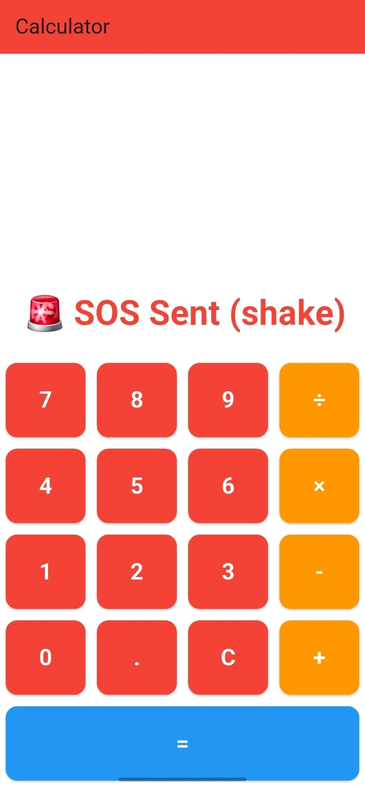
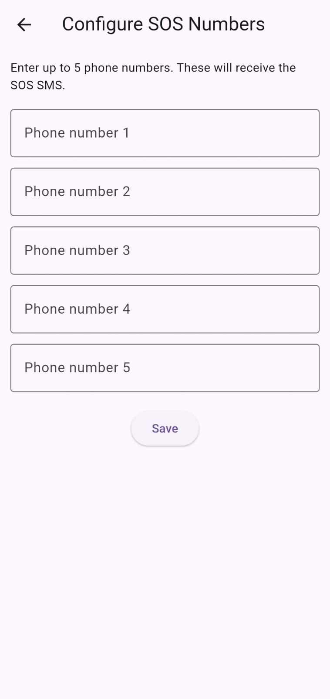
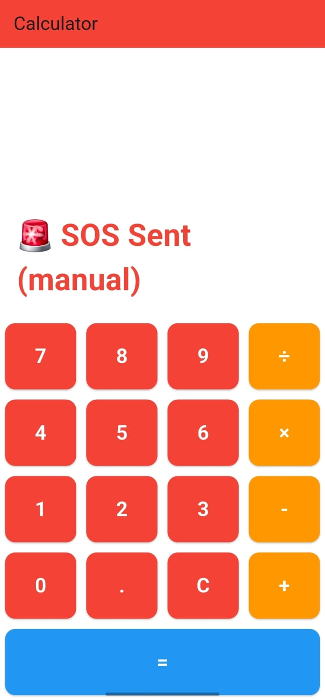

# SOS Emergency App


<p align="center">  <br /> <em>Calculator-based SOS interface</em> </p> <p align="center">  <br /> <em>Shake-trigger SOS</em> </p> <p align="center">  <br /> <em>Phone number slots</em> </p> <p align="center">  <br /> <em>SOS sent when 911 is entered.</em> </p> <p align="center">  <br /> <em>SOS SMS</em>

## Table of Contents
- [Introduction](#introduction)
- [Features](#features)
  - [Implemented Features](#implemented-features)
  - [Planned Features](#planned-features)
- [Technologies Used](#technologies-used)
- [Installation](#installation)
- [Usage](#usage)
- [Contributing](#contributing)
- [License](#license)

## Introduction

The SOS Emergency App is a mobile safety application designed for rapid response during emergencies. Users can trigger SOS alerts discreetly via a calculator interface (911) or by shaking the device. Once activated, the app automatically:

Sends SMS alerts with current location 

Initiates a call to a primary emergency contact

Changes the UI upon triggering SOS

This app ensures fast, reliable personal safety and prompt emergency communication.

## Features

### Implemented Features
- **SOS Trigger via Calculator**: Enter 911 to activate SOS immediately.

- **Shake Detection**: Trigger SOS automatically by shaking the phone.

- **SMS Alerts**: Sends emergency messages containing location updated every 5 minutes.

- **Location Tracking**: Real-time location sharing with emergency contacts during an alert.

- **Automated Triggering**: The app can be automated to trigger alerts by shaking the phone.

- **Contact Slots**: Provision to add contact details of upto 5 people.

- **Visual SOS Indicator**: Visual SOS Indicator: UI changes color to red during active SOS mode.

### Planned Features
- **My Circle**: Access a list of emergency contacts, including five favorites (e.g., 911, Mom, Dad, Sis, and Bro) at the top for immediate reach.
- **Settings Page**: Configure notifications, emergency triggers, location settings, and health monitoring features.
- **Profile Management**: Users can manage their profiles and adjust settings according to their preferences.
- **Camera and Notification Icons**: Visual icons are implemented for quick access to camera functions and notifications.
- **Voice Activation**: Implementing voice commands to activate emergency alerts for hands-free operation.
- **Customizable Alert Messages**: Allow users to customize the messages sent during an emergency alert.
- **Integration with Health Monitoring Devices**: Sync with devices like smartwatches for automatic health data transmission during emergencies.
- **Community Support Feature**: Connect users with nearby emergency responders or community volunteers in real-time.
- **Multiple Language Support**: Making the app accessible to a wider audience by supporting multiple languages.
- **Emergency Resources Directory**: A built-in directory of local emergency services, hospitals, and shelters.
- **User Feedback System**: Allow users to provide feedback on their experience to improve app functionality.

## Technologies Used
- **Mobile Framework**: Flutter
- **State Management & Utilities**: shared_preferences, shake
- **Device Services**: geolocator, telephony, image_picker, record, path_provider
- **UI & Styling**: google_fonts, url_launcher
- **Testing & Linting**: flutter_test, flutter_lints
- **APIs**: Geolocation API, SMS sending API

## Installation

To install the SOS Emergency App locally, follow these steps:

1. Clone the repository:
   ```bash
   git clone https://github.com/Thabhelo/SOSv1.1.git
   ```
2. Navigate to the project directory:
```bash
  cd SOSv1.1
```
3. Install the necessary dependencies:
```bash
  flutter pub get
```
4. Build the app using flutter(Android Studio):
```bash
  flutter build apk --release
```
## Usage
1. Launch the app on your mobile device.
2. Long press on the "Calculator", to set emergency contacts.
3. Dial 911 and press '=' OR Shake the phone to trigger the SOS.
4. Press clear to stop the trigger.
5. When the SOS is triggered, an SMS will be sent to the emergency contacts along with the current location updated every 5 minutes using google maps.

## Contributing
Contributions are welcome! Please follow these steps to contribute to the SOS Emergency App:

1. Fork the repository.
2. Create a new branch for your feature or fix:
```bash
git checkout -b feature/YourFeature
```
3. Commit your changes:
```bash
git commit -m "Add Your Feature"
```
4. Push to the branch:
```bash
git push origin feature/YourFeature
```
5. Open a Pull Request.
   
## License

This project is licensed under the MIT License - see the LICENSE file for details.

For any inquiries or support, please contact the team at nikhiljohnson2006@gmail.com or shawnsabu10@gmail.com or mnn314127@gmail.com or ashishjoy2006@gmail.com
